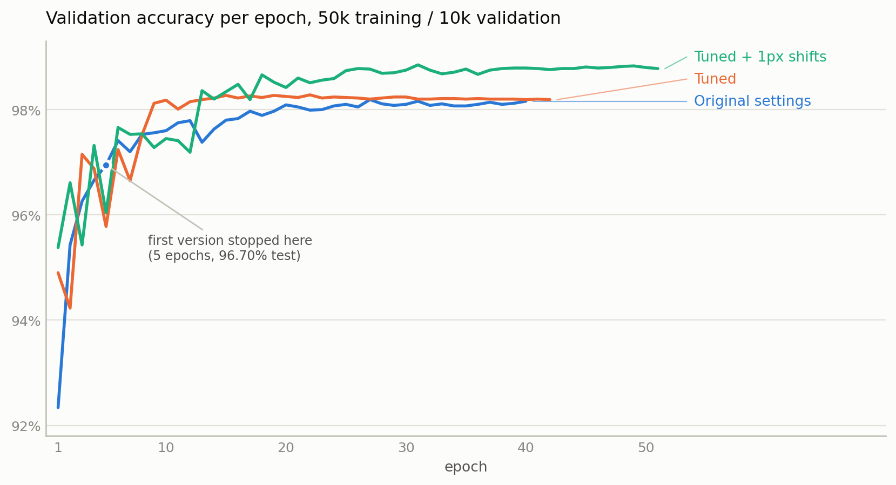

# MNIST from scratch

A fully connected neural network — forward pass, backpropagation, mini-batch stochastic
gradient descent — written from first principles. NumPy is used for linear algebra and
nothing else: no autograd, no optimiser library, no ML framework. Every gradient in this
repository was derived by hand and is verified against numerical differentiation in the
test suite.

**98.69% test accuracy** on MNIST (1.31% error), in 6.4 minutes of training on two CPU cores.

## Results

Trained on 50,000 images, tuned against a held-out 10,000, and scored **once** on the
10,000-image test set. All four rows use the same code; only the hyperparameters differ.

| Configuration | Validation | Test | Epochs | Wall clock |
|---|---|---|---|---|
| Sigmoid + quadratic cost, lr 1.0, batch 10 | 96.95% | 96.70% | 5 | 1.2 min |
| …the same settings, trained to convergence | 98.19% | 98.16% | 40 | 9.9 min |
| Tuned: tanh + softmax/log-likelihood, lr 0.3, batch 32, L2 λ=1 | 98.28% | 98.23% | 42 | 4.8 min |
| **Tuned + one-pixel translations** | **98.85%** | **98.69%** | 51 | 6.4 min |

Architecture throughout: `784 → 256 → 128 → 10`. Timings are two cores of a cloud VM,
so treat them as relative, not absolute.

An honest reading of that table: **the single largest gain came from training for longer**,
not from any clever choice — 5 epochs to 40 is worth about 1.5 points, and everything else
put together is worth about half a point on top. The one genuinely valuable hyperparameter
was data augmentation. Cost function, activation and layer sizes each moved the result by
less than the noise floor (see [Tuning notes](#tuning-notes)).



## Layout

```
network.py     activations, costs, the Network class, gradient checking
data.py        CSV/npz loading, caching, the train/validation split
train.py       command-line training and evaluation
draw_demo.py   draw a digit with the mouse and have the network read it
tests/         32 tests, the important ones being the gradient checks
```

## Usage

```bash
pip install -r requirements.txt

# train with the tuned defaults
python train.py --train mnist_train.csv --test mnist_test.csv

# reproduce the textbook baseline
python train.py --layers 784 30 10 --activation sigmoid --cost quadratic \
                --lr 3.0 --batch-size 10 --no-augment --epochs 30

# score a saved model and try it on your own handwriting
python train.py --load model.npz --test mnist_test.csv --draw
```

`train.py --help` lists every option. CSVs are accepted with or without a header row and
cached as `.npz` after the first read, since parsing 60,000 rows of text is slower than
the training epoch that follows it.

## The maths

Writing `a^l` for the activations of layer `l`, `z^l = W^l a^{l-1} + b^l`, and
`δ^l = ∂C/∂z^l`, the four equations the code implements are

```
δ^L = ∇_a C ⊙ σ'(z^L)                     (output error)
δ^l = ((W^{l+1})^T δ^{l+1}) ⊙ σ'(z^l)      (backwards recurrence)
∂C/∂b^l = δ^l                              (bias gradient)
∂C/∂W^l = δ^l (a^{l-1})^T                  (weight gradient)
```

Three details are worth spelling out, because they are where the accuracy came from.

**Why the cost function is paired with the output layer.** With a quadratic cost and a
sigmoid output, `δ^L = (a - y) ⊙ σ'(z)`. When the network is confidently wrong, `z` is
large, `σ'(z) ≈ 0`, and the gradient vanishes exactly when the error is largest — the
network learns slowest when it has most to learn. Cross-entropy with a sigmoid output, and
log-likelihood with a softmax output, both give `δ^L = a - y` with no `σ'` factor at all:
the `σ'(z)` in the derivative of the cost cancels the `σ'(z)` from the output non-linearity.
That is the whole argument, and it is why those two pairings — and only those two — are
what `network.py` allows.

**Why weights are initialised as N(0, 1/n_in).** With `n` inputs and unit-variance weights,
`z = Σ w_j a_j + b` has standard deviation `√n`, so for 784 inputs a typical neuron starts
several units into the flat tail of the sigmoid and is saturated before training begins.
Dividing by `√n_in` makes `z` order 1 regardless of layer width. ReLU wants `√(2/n_in)`
instead, because it discards the negative half of the distribution.

**Why the mini-batch gradient is a mean and not a sum.** Summing per-sample gradients makes
the effective learning rate proportional to the batch size, so changing the batch size
silently changes the step length too. `test_batch_gradient_is_mean_of_single_sample_gradients`
pins this down.

Everything is expressed on a whole mini-batch at once: activations are `(n_layer, batch)`
matrices, and there is no Python-level loop over samples anywhere in training or inference.

## Correctness

The test suite (`python -m pytest tests`) checks, among other things:

- **Gradient checking.** Analytic gradients from `backprop` are compared against central
  differences `(C(θ+ε) − C(θ−ε)) / 2ε` for every cost × activation combination, requiring
  agreement to 1e-6 relative. This is the only test that reliably catches a backprop bug:
  a wrong gradient usually still trains, just worse, so the network's accuracy is not
  evidence that the derivation is right.
- The mini-batch gradient equals the mean of the per-sample gradients.
- `δ^L = a − y` for the matched cost/output pairs, and *not* for the quadratic cost.
- Softmax and sigmoid stay finite at ±800 (both are implemented in shift/branch form
  rather than the textbook expression, which overflows).
- Every sample is used when the batch size does not divide the training set.
- A CSV header row is detected rather than silently eaten as a training example.
- Save/load round-trips to identical predictions.

## Tuning notes

Every number below is validation accuracy on the 10,000 held-out images; the test set was
not consulted until the configuration was frozen. On 10,000 samples at ~98%, one standard
error is about 0.14 points, so **differences smaller than roughly 0.4 points are noise** —
which turns out to describe most of the search.

Learning rate against cost function, `784 → 100 → 10`, 20 epochs:

| lr | Quadratic | Cross-entropy | Log-likelihood |
|---|---|---|---|
| 0.03 | 91.29% | 95.24% | 95.02% |
| 0.1 | 93.53% | 97.03% | 97.09% |
| 0.3 | 95.94% | 97.74% | 97.58% |
| 1.0 | 97.42% | 97.77% | **97.74%** |
| 3.0 | **97.73%** | 95.34% | 97.59% |

The textbook claim is that cross-entropy beats quadratic cost. What the sweep actually
shows is subtler: at *its own* best learning rate the quadratic cost is within noise of the
others. What cross-entropy buys is **robustness** — it is near its best across a 10× range
of learning rates, where the quadratic cost loses six points over the same range because
the `σ'` factor throttles early learning. The practical value is that you spend far less
time hunting for a learning rate, which matters more than the final decimal.

Everything else, briefly:

- **Activation** (`784 → 100 → 10`, best lr each): sigmoid 97.74%, tanh 97.85%, ReLU 97.70%.
  All within noise; tanh was kept only because it happened to come out marginally ahead.
- **Width and depth**: `784→100→10` 98.0%, `784→256→10` 98.1%, `784→512→10` 98.1%,
  `784→256→128→10` 98.3%. Two hidden layers helped a little; 512 units did not beat 256.
- **L2**: λ = 5 marginally beat λ = 1 and λ = 0 on the small net, and λ = 1 was best on
  the large one. Differences under 0.2 points throughout.
- **Batch size**: 32 was best (98.33%), 16/64/128 all landed between 98.04% and 98.13%.
  Momentum at 0.9, with the learning rate scaled by (1−μ) to keep the effective step
  fixed, did not help at any batch size.
- **Augmentation**: randomly translating each image by up to one pixel each epoch was the
  only change worth more than the noise floor — 98.33% → 98.57% at 60 epochs, and 98.85%
  when allowed to run to 51 epochs with early stopping. It also delays convergence, since
  the network sees a harder problem.

The obvious caveat: one seed per configuration. With differences this small, a proper
comparison would average three to five seeds, and the ranking of everything except
augmentation would probably shuffle.

## Performance

Batching turned the per-sample Python loop into matrix products, with identical maths:

| | Per-sample loop | Batched |
|---|---|---|
| Training, 50k samples, batch 10 | 53.8 s/epoch | 18.9 s/epoch |
| Training, 50k samples, batch 32 | — | 5.3 s/epoch |
| Inference, 10k images | 1.3 s | 0.22 s |

`784 → 256 → 128 → 10`, two cores. The remaining cost is dominated by BLAS, so the next
real speedup would be `float32` (roughly 2×) rather than anything algorithmic.

## The drawing demo

`draw_demo.py` opens a canvas, and preprocesses whatever you draw the way the MNIST authors
did: the digit is scaled so its longest side is 20 pixels, then placed in a 28×28 frame with
its **centre of mass** at the centre. Cropping and resizing to 28×28 without that step
produces digits that sit differently in the frame from anything in the training set, which
is the usual reason a demo feels much less accurate than the reported test score.

## Limitations and next steps

- A fully connected network has no notion that neighbouring pixels are related; it sees 784
  independent inputs. The step from ~98.7% to >99.2% is a convolutional architecture, not
  more tuning.
- Augmentation here is one-pixel translations only. Small rotations and elastic distortions
  are the standard next step.
- No ensembling, no dropout, no batch normalisation.
- Single seed per configuration, as noted above.

## References

Michael Nielsen, *Neural Networks and Deep Learning* — the source of the notation, the
cross-entropy and `1/√n` initialisation arguments, and the observation that expanding the
training data with small translations is one of the cheapest accuracy wins available.
